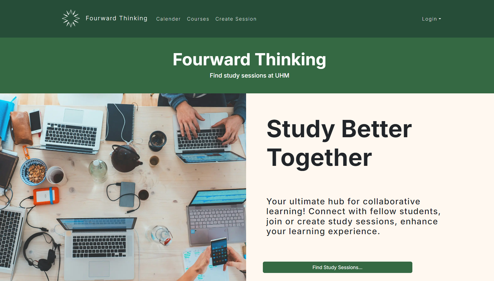
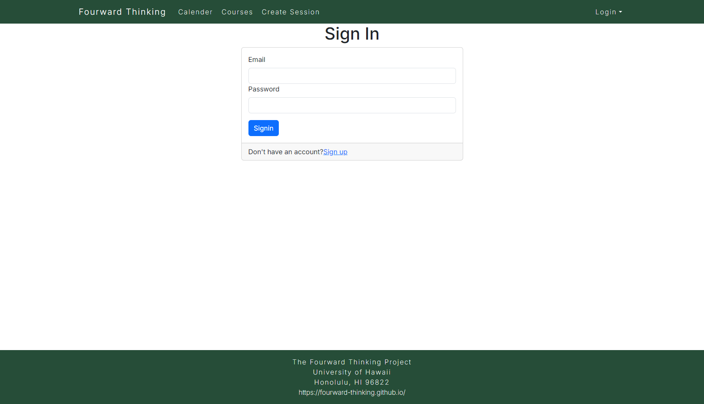
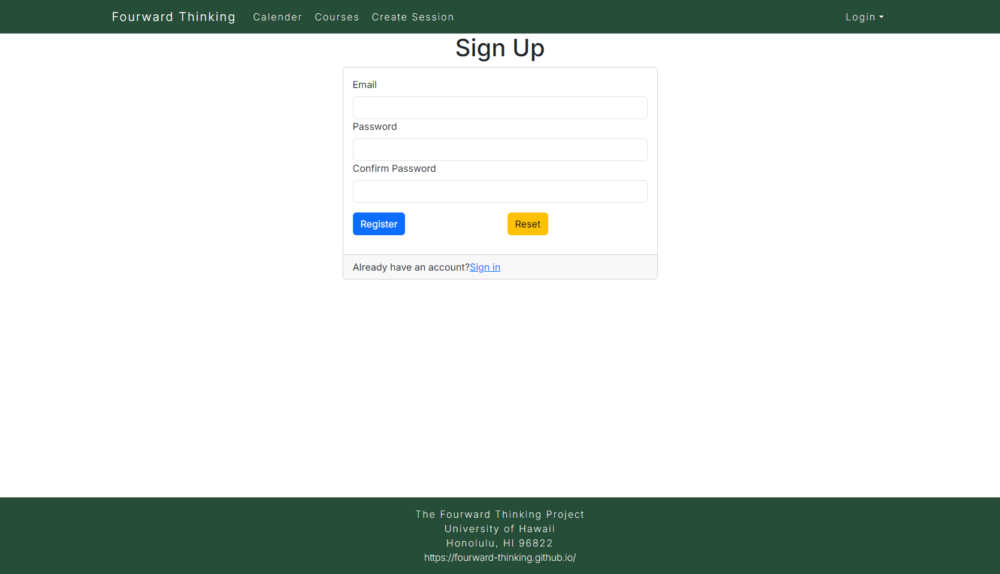
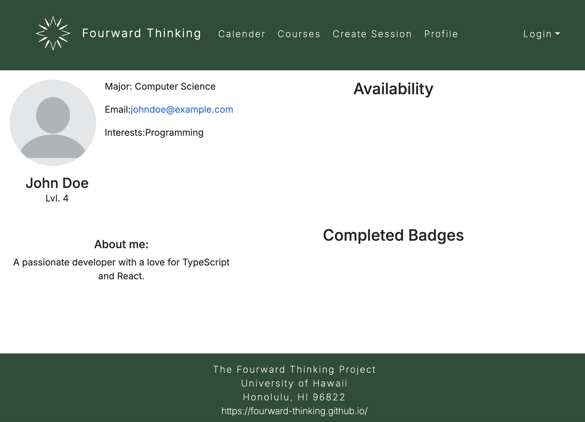
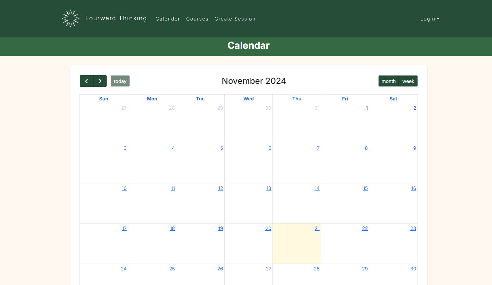
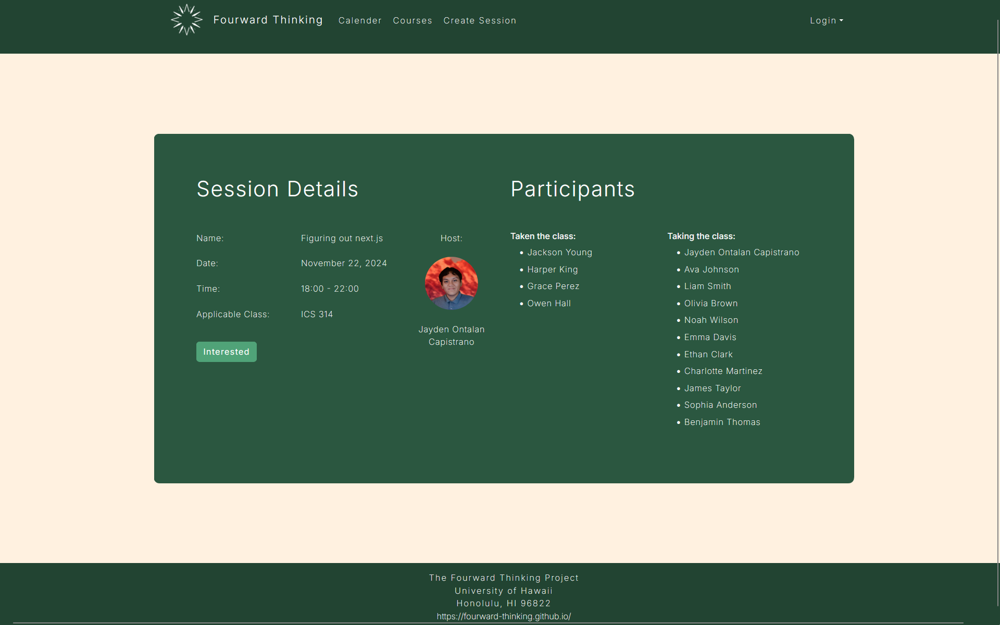
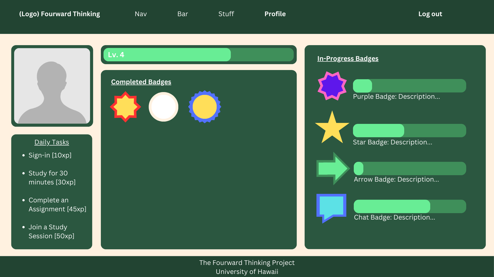
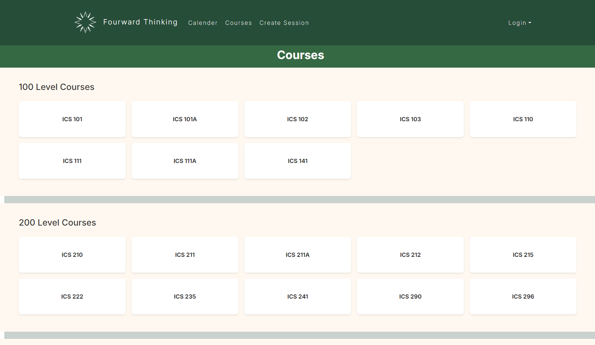
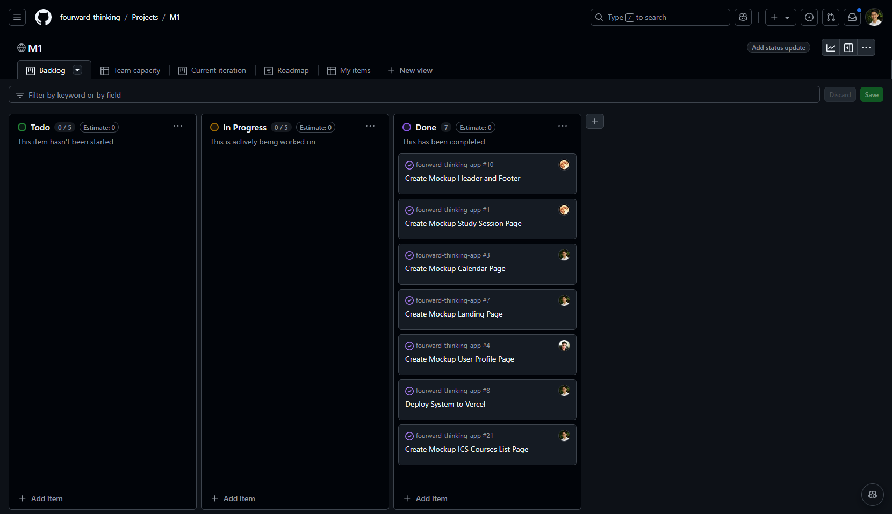
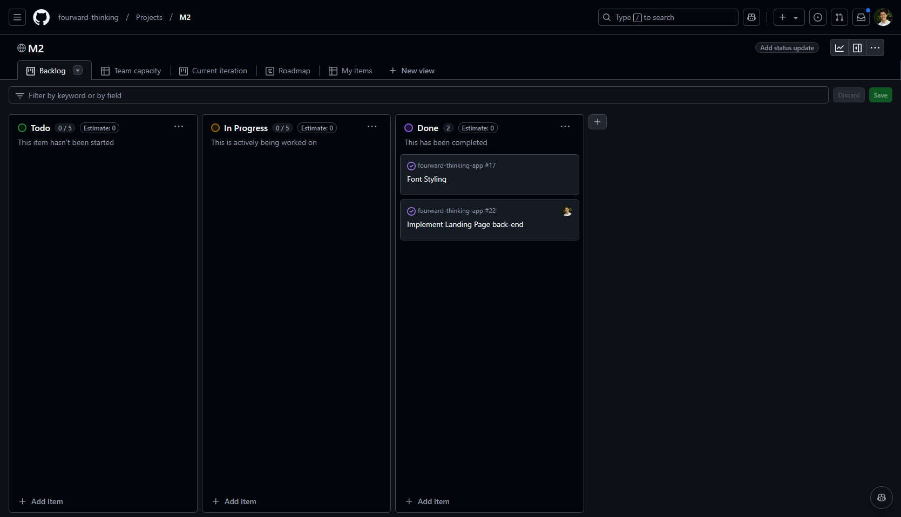

# Fourward Thinking

## Table of Contents
* [Overview](#overview)
* [Deployment](#deployment)
* [Approach](#approach)
* [User Guide](#user-guide)
* [Community Feedback](#community-feedback)
* [Developer Guide](#developer-guide)
* [Milestone 1](#milestone-1)
* [Milestone 2](#milestone-2)
* [Milestone 3](#milestone-3)
* [Going Further](#going-further)
* [Team](#team)

## Overview

*The Problem*: ICS students often spend more time than necessary on their homework and struggle to learn the material as effectively as possible, primarily because they study in isolation and don't take advantage of the benefits offered by face-to-face study groups with peer mentors.

*The Solution*: Fourward Thinking is an application designed for UHM ICS students to easily organize face-to-face study groups focused on specific courses, homework assignments, or project topics.

## Deployment

Our project is live on Vercel!

[Fourward Thinking App](https://fourward-thinking-application.vercel.app/)

## Approach

Fourward Thinking is an app designed to help ICS students connect with each other for peer-to-peer study sessions. To get started, students must log in and set up their profile. The profile allows students to list the courses they've completed, where they are available to offer help, as well as the courses they are currently enrolled in, where they may need assistance. This means every student can play both roles—in the curriculum. Students are also required to upload a profile picture to ensure they can be easily identified.

The app features a section where all ICS courses are listed. For each course, students can view others who are currently enrolled or have completed the course. A student can propose a study session focused on a specific topic they need help with (e.g., "Help me with my essay on configuration management"), along with a suggested meeting time in the ICSpace (e.g., 8:30–9:30 PM tonight). Once the proposal is made, a notification is sent to all relevant members of the ICS department, allowing them to indicate whether they plan to attend the session at the proposed time.

There is also an online calendar that shows all scheduled study sessions and the participants for each.

Fourward Thinking offers two modes for organizing study sessions:

  **Planned Sessions**: If you want to arrange a group study session for later, you can schedule it for a specific time in the future.

  **Immediate Help:** If you need help right away, you can select “Right Now” to indicate you’re currently in ICSpace and need assistance. This alerts all the relevant members of the ICS department for your course, allowing others to join in and create a spontaneous study group.

Administrators oversee the platform and can be contacted by users if they encounter any inappropriate behavior.
Key Design Goals for Fourward Thinking:

  - Encourage ICSpace Use: Promote ICS students to use the ICSpace for study sessions.
  - Minimize Risks: Ensure all study sessions take place in ICSpace, reducing the chances of inappropriate encounters.
  - Foster Face-to-Face Interaction: Promote direct, in-person collaboration among ICS students.

## User Guide
Below, users may find a list of pages available for use.

* **Landing Page:**
  Overview of the app, encourage users to search for active study sessions.
  
  

* **Sign In:**
  A window prompting users to sign into their account.

  

* **Sign Up:**
  A window prompting users to create an account if they don't already have one.

  
  
* **User Home Page:**
  A personalized dashboard showing upcoming study sessions, notifications, and a quick way to join or propose new sessions.
  
* **Admin Home Page:**
  Admin tools for overseeing activity, monitoring reports, and managing content.
  
* **User Profile Page:**
  Allows users to input their course information, headshot, and optional availability for other commitments. Display earned points and badges.
  
  
  
* **Calendar Page:**
  Displays upcoming and past study sessions. Users can filter by course, topic, and time. Shows both group study sessions and solo sessions.

  
  
* **Create Study Session Page:**
  A page where students seeking help can propose study sessions on specific topics and schedule a time.
  
  
  
* **Study Session Page:**
  Details of a specific study session, including participants, topic, time, and a status tracker (e.g., ongoing, completed).
  
  
  
* **Game Mechanic Page(s):**
  Displays the point or level system, solo and group rankings, and details of available rewards.
  
  

* **ICS Courses List:**
  Where users can view a list of all available ICS courses, as well as those who are taking or have taken said courses.

  

## Community Feedback
We have received feedback from some UH community members, as of 12/12/2024.

### Person 1:
- Good looking landing page.
- A tutorial section when you scroll down might help, because there isn't much instruction when you open the website.
- Profile page could use a touch-up.

### Person 2:
- I like the design of the pages, but they need more buttons that work.
- How am I supposed to add people or look for study sessions?
- I really like the direction, but some parts of the website feel incomplete.

### Person 3:
- Website feels unpolished and incomplete.
- Can't sign in or create session.
- Keep working on this project! With time, it can be great.

### Person 4:
- The calendar page looks promising, but it feels a bit empty. Maybe add a sample schedule or some quick actions to create events.
- It's not clear how to link the calendar to specific courses or sessions.
- The overall design is nice, but more interactivity would make it feel complete.

### Person 5:
- The courses page has potential, but needs more features. Perhaps an option to filter courses or search by keywords?
- The profile page seems very unfinished. Formatting it would bring the visuals of the webstie together.
- It would be cool if the calendar page and courses were connected somehow.

## Developer Guide
This section provides information of interest to developers that want to use this code base as a basis for their own development tasks.

### Installation

First, [install npm](https://docs.npmjs.com/cli/v9/commands/npm-install).

Second, visit the [Fourward Thinking application github page](https://github.com/fourward-thinking/fourward-thinking-app), and click the "Use this template" button to create your own repository initialized with a copy of this application. Alternatively, you can download the sources as a zip file or make a fork of the repo. However you do it, download a copy of the repo to your local computer.

Third, cd into the fourward-thinking-app/app directory and install libraries with:

``$ npm install``

Fourth, run the system with:

``$ npm run start``

If all goes well, the application will appear at http://localhost:3000.

### Quality Assurance

#### ESLint

Fourward Thinking includes a .eslintrc file to define the coding style adhered to in this application. You can invoke ESLint from the command line as follows:

``$ npm run lint``

ESLint should run without generating any errors. It's sigificantly easier to do development with ESLint integrated directly into your IDE (such as VSCode).

## Milestone 1
The goal of Milestone 1 was to create several HTML mockup pages in the system. Our Milestone 1 project board can be found on our [GitHub Project M1 Page](https://github.com/orgs/fourward-thinking/projects/1).

## Milestone 2
The goal of Milestone 2 was to add a few more mockup pages, as well as to implement the back-end of in-place mockups. Our Milestone 2 project board can be found on our [GitHub Project M2 Page](https://github.com/orgs/fourward-thinking/projects/3).

## Milestone 3
The goal of Milestone 3 was to complete all remaining functionality within the app, and polish the user interface. Our Milestone 3 project board can be found on our [GitHub Project M3 Page](https://github.com/orgs/fourward-thinking/projects/4).

## Going Further
After implementing the basic functionality, here are ideas for more advanced features:

* Text message interface. See notifications, and reply to confirm attendance all through text message.
* Slack integration to facilitate notification and organization of meetings.
* A Slack Bot to suggest and help implement Fourward Thinking meetings.
* A rating system for meetings and  participation.

## Team

Fourward Thinking is designed, implemented, and maintained by Kaena Sylva and Jayden Capistrano.

Team Contract can be found [here](https://docs.google.com/document/d/1eQ3XoFDD-6ArQlqjSbglP0_gA7TwmLjyn-lzj64xbVA/edit?usp=sharing).
