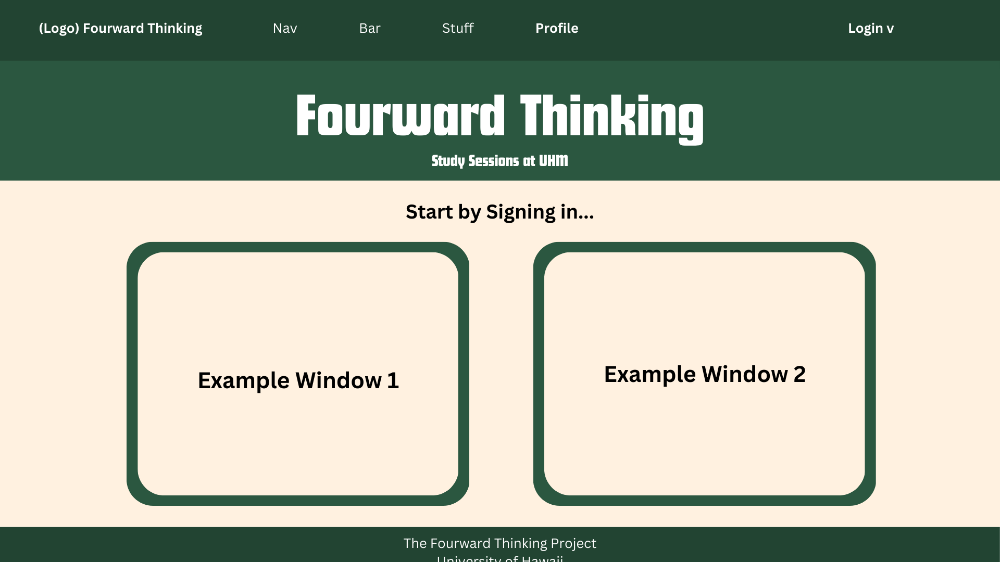
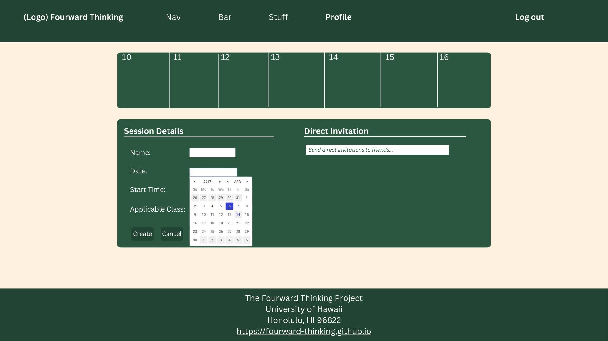
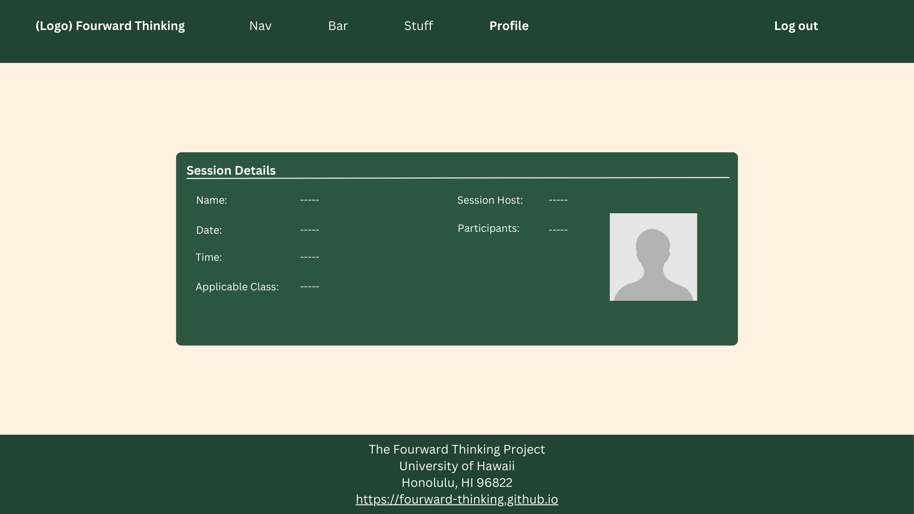

# Fourward Thinking

## Table of Contents
* [Overview](#overview)
* [Approach](#approach)
* [Mockup Pages](#mockup-pages)
* [Use Case](#use-case-ideas)
* [Going Further](#going-further)
* [Team](#team)

## Overview

*The Problem*: ICS students often spend more time than necessary on their homework and struggle to learn the material as effectively as possible, primarily because they study in isolation and don't take advantage of the benefits offered by face-to-face study groups with peer mentors.

*The Solution*: Fourward Thinking is an application designed for UHM ICS students to easily organize face-to-face study groups focused on specific courses, homework assignments, or project topics.

## Approach

Fourward Thinking is an app designed to help ICS students connect with each other for peer-to-peer study sessions. To get started, students must log in and set up their profile. The profile allows students to list the courses they've completed, where they are available to offer help (as a Sensei), as well as the courses they are currently enrolled in, where they may need assistance (as a Grasshopper). This means every student can play both roles—Sensei in some courses and Grasshopper in others. Students are also required to upload a profile picture to ensure they can be easily identified.

The app includes a section where all ICS courses are listed. Within each course, students can view the Grasshoppers and Senseis for that course. A Grasshopper can propose a study session around a specific topic they are working on (e.g., “Help me with my essay on configuration management”), along with a suggested time to meet in ICSpace (e.g., 8:30–9:30 PM tonight). This proposal triggers a notification to all other Grasshoppers and Senseis for that course, who can then indicate whether they plan to attend the session at that time.

There is also an online calendar that shows all scheduled study sessions and the attendees for each.

Fourward Thinking offers two modes for organizing study sessions:

  **Planned Sessions**: If you want to arrange a group study session for later, you can schedule it for a specific time in the future.

  **Immediate Help:** If you need help right away, you can select “Right Now!” to indicate you’re currently in ICSpace and need assistance. This alerts all the Senseis and Grasshoppers for your course, allowing others to join in and create a spontaneous study group.

Administrators oversee the platform and can be contacted by users if they encounter any inappropriate behavior.
Key Design Goals for Fourward Thinking:

  - Encourage ICSpace Use: Promote ICS students to use the ICSpace for study sessions.
  - Minimize Risks: Ensure all study sessions take place in ICSpace, reducing the chances of inappropriate encounters.
  - Foster Face-to-Face Interaction: Promote direct, in-person collaboration among ICS students.

## Mockup Page Ideas
Some mockup pages include:

* **Landing Page:**
  Overview of the app, call to action for new users to sign up or log in.
  
  
  
* **User Home Page:**
  A personalised dashboard showing upcoming study sessions, notifications, and a quick way to join or propose new sessions.
  
* **Admin Home Page:**
  Admin tools for overseeing activity, monitoring reports, and managing content.
  
* **User Profile Page:**
  Allows users to input their course information, headshot, and optional availability for other commitments. Display earned points and badges.
  
  
  
* **Calendar Page:**
  Displays upcoming and past study sessions. Users can filter by course, topic, and time. Shows both group study sessions and solo sessions.
  
* **Create Study Session Page:**
  A page where students seeking help can propose study sessions on specific topics and schedule a time.
  
  
  
* **Study Session Page:**
  Details of a specific study session, including participants, topic, time, and a status tracker (e.g., ongoing, completed).
  
  
  
* **Game Mechanic Page(s):**
  Displays the point or level system, solo and group rankings, and details of available rewards.
  
  

* **Notifications Page:**
  Where users can configure their notification preferences, including the option to mute notifications based on course commitments or personal time.

## Use Case
Whether or not the following bullet points list all pages or not, the completed use case should show an end-to-end scenario of using the system.

* New user goes to landing page, logs in, gets home page, sets up profile. (How do they learn how system works?)
* Admin goes to landing page, logs in, gets home page, edits site.
* User goes to landing page, logs in, requests study sesh.
* User is notified of study sesh, responds. (Can they respond via text message?)
* User checks their status with respect to game mechanics.

## Going Further
After implementing the basic functionality, here are ideas for more advanced features:

* Text message interface. See notifications, and reply to confirm attendance all through text message.
* Slack integration to facilitate notification and organization of meetings.
* A Slack Bot to suggest and help implement Fourward Thinking meetings.
* A rating system for meetings and sensei participation.

## Team

Fourward Thinking is designed, implemented, and maintained by Kaena Sylva, Aldwin Santos, Jayden Capistrano, and Joshua Scott.

Team Contract can be found [here](https://docs.google.com/document/d/1eQ3XoFDD-6ArQlqjSbglP0_gA7TwmLjyn-lzj64xbVA/edit?usp=sharing).
